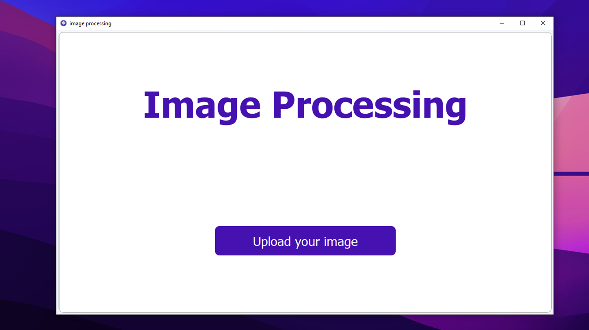

# Image Processing Project

## Introduction

Welcome to the Image Processing project! This project is designed to facilitate image processing tasks through a user-friendly interface.

1. **Landing Section.**



2. **Select Image from Local PC.**


3. **Modify Image on App.**


## Getting Started

To run the project locally, follow these steps:

1. **Clone the Repository:**
   ```bash
   git clone https://github.com/Hesham-poraik/multimedia_project
   cd image-processing-project
2. **run main file:**
   ```bash
   python main.py
To build the project locally, follow these steps:
1. **build with pyinstaller.py:**
   ```bash
   pyinstaller -F -w -i assets/app.ico main.py